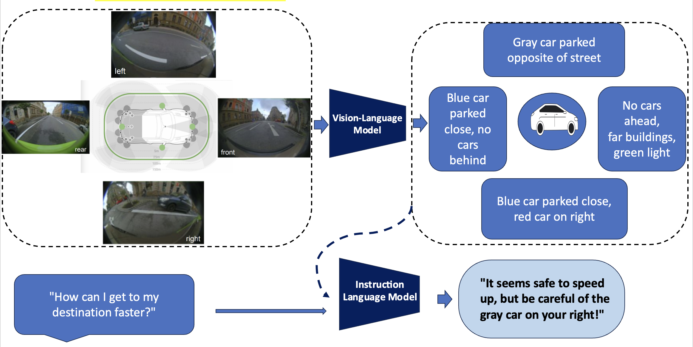

<h1 align="center">
  <span> Driving Assistant -- Visual Instruction Dataset </span>
</h1>

<div align="center">
     
</div>

# Project Features

- [Visual_Understanding_model](#Vision-language-model)
- [Instruct_LLM](#Instruct-LLM)
- [Generate Visual Instruction](#generate-visual-instruct-dataset)
- [To Dos](#improvement-features)

## Vision-Language Model:

- Using [BLIP2]() & [InstructBLIP] () to extract the Visual information  
    + BLIP2 
    + InstructBLIP 

+ *Note*: All BLIP2 & InstructBLIP contain in *blips.py*

## Instruct LLM via GPT Model 

- Using GPT Model to Create Questions Related to Domain Specific

    + Example Create the Instruction question input related Driving
        ```
        input_INSTRUCTION = \
        "I have an image. " \
        "Ask me questions about the content of this image related to Driving Domain, the information providing is related to street views information. " \
        "Carefully asking me informative questions to maximize your information about this image content. " \
        "Each time ask one question only without giving an answer. " \
        "Avoid asking many yes/no questions." \
        "I'll put my answer beginning with \"Answer:\"." \
        ```
- Using GPT Model Provides the Assistant Suggestion 

    ```
    solution_INSTRUCTION = \
    'Now summarize the information you get from abstract visual information. ' \
    'Based on the summarize information, you are a helpful assistant please provide some suggestions, advices and other assistance to Driver. ' \
    'Don\'t add information. Don\'t miss information. \n' \
    'Summary: '
    ``` 

- Based on input_INSTRUCTION & Assistant Suggestion 

    + Create Instruction Input Corresponding to (Abstract information)

+ *Note*: To Construct GPT prompts instruction is contain in *llm_gpt.py*

## Generate Visual Instruction on StreetView Dataset 

- Working on Public Dataset on StreetView dataset [Cityscape](https://www.cityscapes-dataset.com/dataset-overview/#features)
   
    ```
    Data Structure of CityScape Dataset
            cityscapes
        ├── gtFine # Segmentation Label
        │   ├── test (19 City Folders)
        │   ├── train (19 City Folders)
        │   └── val (19 City Folders)
        └── leftImg8bit
            ├── test (19 City Folders)
            ├── train (19 City Folders)
            └── val (19 City Folders)
    ```

+ *Note*: To Generate The frist Version of Visual instruction dataset contain *generate_data.py*

    ```
    1st: export OPENAI_API_KEY=your key in terminal 
    2nd: python generate_data.py
    ```

## Todo List for Improvement Next Version

1. Continue via to Enrich Visual Information [Open-Flamingo](https://github.com/mlfoundations/open_flamingo), [Prismer](https://shikun.io/projects/prismer), [GRIT](https://github.com/JialianW/GRiT), [KOSMOS-2](https://github.com/microsoft/unilm/tree/master/kosmos-2)

2. Construct others Type of GPT Instruction Prompt 
