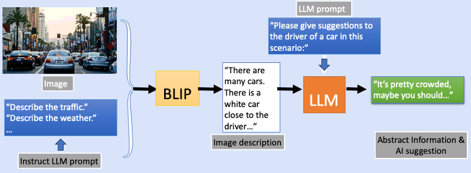

<h1 align="center">
   Driving Assistant -- Visual Instruction Dataset 
</h1>

     

# Project Features

- [Visual_Understanding_model](#Vision-language-model)
- [Instruct_LLM](#Instruct-LLM)
- [Generate Visual Instruction](#generate-visual-instruct-dataset)
- [To Dos](#improvement-features)

## Vision-Language Model:

## Instruct LLM via GPT Model 

## Generate Visual Instruction on StreetView Dataset 

## List of New Plan for Improvement 
